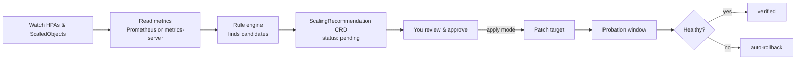

<h1 align="center">OpenHPA</h1>

<p align="center">
  Open-source Kubernetes operator that tunes HPA and KEDA autoscaling.
</p>

<p align="center">
  <a href="LICENSE"></a>
  <a href="https://github.com/tonyschneider/openhpa/actions/workflows/ci.yml"></a>
  <a href="https://github.com/tonyschneider/openhpa/releases"></a>
  
  
</p>

OpenHPA looks at how your HorizontalPodAutoscalers and KEDA ScaledObjects have actually behaved over
time, then recommends better settings: `minReplicas`, `maxReplicas`, CPU targets, and cooldowns.
Every recommendation is a Kubernetes custom resource you read with `kubectl`, backed by the metrics
that produced it.

It runs entirely inside your cluster. Out of the box it is read-only and makes zero outbound network
calls: it reads metrics, writes recommendations, and stops there. You decide whether to apply a
change by hand, through GitOps, or by letting OpenHPA apply it behind a probation and auto-rollback
safety net.

```bash
helm install openhpa oci://ghcr.io/tonyschneider/charts/openhpa \
  --namespace openhpa --create-namespace

kubectl get scalerec -A
```

## Why

Autoscaling config rots. Floors set high during an incident never come back down. CPU targets get
copy-pasted between services and never revisited. Autoscalers thrash, or lag behind real traffic.
Nobody has time to audit it by hand.

OpenHPA does that audit continuously and shows its work:

- **Deterministic, not a black box.** A rule engine (not a model) makes every recommendation and
  every safety decision. Results are reproducible and explainable.
- **Optional LLM, off by default.** Point it at your own OpenAI or Anthropic key and it will add a
  plain-language explanation on top of the deterministic result. It is never required and never in
  the safety path.
- **No strings.** Apache-2.0, no license keys, no tiers, no telemetry, no account.

> OpenHPA tunes *horizontal* scaling (how many replicas, and when). It does not touch container
> CPU/memory requests and limits. For vertical rightsizing, pair it with a tool like
> [KRR](https://github.com/robusta-dev/krr). The two solve different problems.

## How it works



1. **Watch.** Reads the live spec of HPAs and KEDA ScaledObjects in the namespaces you configure.
2. **Collect.** Pulls metric history from Prometheus (weeks of real data, survives restarts) or falls
   back to accumulating metrics-server / HPA status each tick.
3. **Analyze.** The rule engine detects idle floors, overprovisioning, thrashing, and scale lag. An
   optional forecaster (off by default) spots recurring daily and weekly peaks.
4. **Recommend.** Writes `ScalingRecommendation` resources you inspect with
   `kubectl get scalerec -A`.
5. **Approve.** A human sets `approved: true` (via `kubectl patch` or GitOps).
6. **Apply** (only in `--mode=apply`). Patches the target, holds it on probation, verifies health,
   and auto-reverts if the workload degrades.

## Detectors

| Detector | Signal | Typical fix |
| --- | --- | --- |
| Idle floor | p95 demand far below the configured `minReplicas` | Lower the floor |
| Overprovisioned | Sustained CPU well under target | Raise the utilization target |
| Thrashing | Frequent scale up/down oscillation | Longer cooldown |
| Scale lag | Workload saturates before scaling catches up | Adjust target or floor |

Each recommendation carries the field-level diff (for example `min_replicas: 10 -> 3`), a risk
level, and an estimated monthly cost delta.

## Applying changes

By default OpenHPA never mutates a workload. To let it apply approved recommendations:

```bash
helm upgrade openhpa oci://ghcr.io/tonyschneider/charts/openhpa \
  --reuse-values --set mode=apply

kubectl patch scalerec <name> -n <ns> --type merge -p '{"spec":{"approved":true}}'
```

When it applies a change to an HPA it patches the target, records a probation window, then judges
post-apply health against the pre-apply baseline. Healthy changes are marked `verified`; degraded
ones are reverted to the exact prior config (`rolledBack`). Rollback only ever restores config
OpenHPA itself set. Leader election makes `replicaCount: 2+` safe.

## What it reads, writes, and sends

| | Detail |
| --- | --- |
| Reads | HPA and ScaledObject specs/status, Deployment metadata, CPU/replica/queue metrics, its own CRDs |
| Writes | `ScalingRecommendation` CRDs (always); HPA/ScaledObject patches (only in `--mode=apply`, only for approved recommendations); a leader-election Lease |
| Sends off-cluster | Nothing by default. Only the optional LLM call, using your key, to the provider you pick |

No phone-home, no telemetry, no license server. Works fully air-gapped.

## Permissions

The chart ships a least-privilege `ClusterRole`. OpenHPA needs **no** access to Secrets: the optional
LLM key is injected as an environment variable, never read through the API. The only mutating grants
are `patch`/`update` on autoscalers, used solely in apply mode. Full table in
[docs/manual/08-security.md](docs/manual/08-security.md).

## GitOps

If Argo CD or Flux owns your autoscaler specs, a direct apply gets reverted on the next sync. That is
expected: Git is the source of truth. Run OpenHPA in recommend-only mode there and fold each
`ScalingRecommendation` back into your manifests. The CRD carries a field-level diff by design, so
GitOps-native pull-request generation can be built on top of it later. See
[ADR 0002](docs/adr/0002-open-source-conversion.md).

## Documentation

- [Overview](docs/manual/01-overview.md) and [architecture](docs/architecture.md)
- [Installation](docs/manual/03-installation.md), including air-gapped
- [Configuration reference](docs/manual/04-configuration-reference.md)
- [Security model](docs/manual/08-security.md)
- Full manual: [docs/manual](docs/manual/)

## Development

Requires Rust 1.91.1 (pinned in [rust-toolchain.toml](rust-toolchain.toml)).

```bash
cargo test -p openhpa-core                            # fast, pure-logic tests, no cluster
cargo test --workspace                                # all unit tests
cargo clippy --workspace --all-targets -- -D warnings
cargo fmt --all

kind create cluster --name openhpa-dev
cargo run -p openhpa-operator
cargo run -p openhpa-operator -- --print-crd          # emit the CRD JSON

docker build -t openhpa .                             # multi-stage, distroless, nonroot
cargo test -p e2e-tests -- --ignored --test-threads=1 # needs a kind cluster
```

Layout:

- `core/` (`openhpa-core`): pure, Kubernetes-free domain logic. Rule engine, forecasting, LLM
  prompt/parse, synthesis. No cluster needed to test it.
- `operator/` (`openhpa-operator`): the kube-rs operator that wires `core` to Kubernetes.
- `deploy/`: the Helm chart. `e2e-tests/`: cluster-backed tests. `docs/`: the manual.

## Contributing

Contributions are welcome. Start with [CONTRIBUTING.md](CONTRIBUTING.md) and the
[Code of Conduct](CODE_OF_CONDUCT.md). Good first areas: new detection rules, KEDA verification
parity with HPA, and GitOps PR generation.

## Roadmap

- [ ] GitOps-native pull-request generation
- [ ] Health verification and auto-rollback for KEDA ScaledObjects (HPA today)
- [ ] Bedrock and local-model LLM backends
- [ ] A read-only `scan` CLI for one-shot audits

## Security

Report vulnerabilities privately per [SECURITY.md](SECURITY.md). Please do not open a public issue
for security reports.

## Maintainer

Built and maintained by Tony Schneider ([@tonyschneider](https://github.com/tonyschneider)).

## License

[Apache 2.0](LICENSE).
