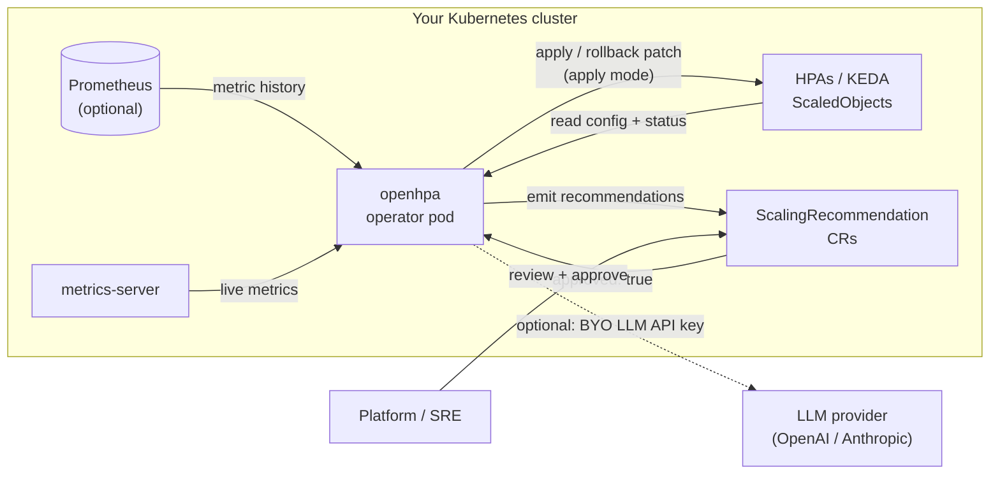

# 1. Overview

## 1.1 What it does

openhpa is a Kubernetes operator that continuously analyzes how your
autoscaled workloads actually behave and proposes better autoscaling configuration. It
follows a deliberate, human-in-the-loop workflow:

```
recommend  →  approve  →  apply  →  verify  →  (auto-rollback on degradation)
```

1. **Recommend.** On each reconcile tick the operator reads your HorizontalPodAutoscalers
   and the workloads behind them, builds a metric history, and runs a rule engine to detect
   optimization opportunities (idle windows, over-provisioning, scale lag, thrashing, and
   recurring peaks). An optional LLM pass — using *your* API key — judges the candidates,
   assigns a risk level, and writes a human-readable summary. The result is persisted as a
   `ScalingRecommendation` custom resource.

2. **Approve.** Nothing is changed until a human approves it. You review the recommendation
   (`kubectl get scalingrecommendations`) and set `spec.approved: true`.

3. **Apply.** The operator applies an approved recommendation to the live HPA or KEDA
   ScaledObject — adjusting `minReplicas` / `maxReplicas`, the CPU target, and the
   scale-down cooldown.

4. **Verify and auto-rollback.** An applied change is held on **probation**. After the
   probation window the operator re-reads the workload's health; if the change degraded it
   (for example, CPU pushed past target), the operator automatically reverts to the previous
   configuration. This is the safety net that makes the apply step low-risk.

For workloads with a strong recurring (daily/weekly) pattern, the operator can additionally
emit a **predictive schedule** that pre-raises the replica floor ahead of each forecasted
peak and restores the baseline afterward.

## 1.2 What it is *not*

- **It does not replace the HPA or KEDA.** Your existing autoscaler keeps making every
  real-time scaling decision. The operator only tunes its *configuration*; it never sits in
  the request path and is not a runtime dependency of your workloads.
- **It is advisory-first.** No change is applied without explicit approval. If you never
  approve a recommendation, the operator is a pure read-only advisor.
- **It is not a SaaS.** There is no central data plane, no cross-account access, and no hosted
  dashboard.

## 1.3 Trust and data residency

- **Runs entirely in your cluster.** Metric collection, analysis, and apply all happen
  in-cluster. No workload metrics or cluster data leave your cluster.
- **No phone-home, no telemetry, no license server.** OpenHPA is Apache-2.0 and works fully
  air-gapped.
- **The only optional outbound call** is to your chosen LLM provider's API, and only when you
  configure one. With `llm.provider=none` (the default) the operator makes no external calls at all.

## 1.4 Architecture



The operator is a single small Rust binary shipped as a distroless, cosign-signed image. It
holds no persistent state of its own beyond the `ScalingRecommendation` resources and a
leader-election Lease; metric history is rebuilt from Prometheus (or accumulated from HPA
status) on each run.

## 1.5 Core concepts

| Concept | Summary |
| --- | --- |
| `ScalingRecommendation` | Namespaced CR (`openhpa.dev/v1alpha1`, short name `scalerec`) holding a target reference, a config diff, a risk level, a summary, optional projected savings, and an optional predictive schedule. |
| Approval | Human gate. The operator applies a recommendation only when `spec.approved` is `true`. |
| Phase | The lifecycle state in `status.phase`: `pending` → `applied` → `verified`, or `rolledBack` / `degraded` / `failed`. See [Usage](./06-usage.md). |
| Probation | The window after an apply during which the operator watches health before declaring a change `verified` (or reverting it). |
| Predictive schedule | Time-based replica-floor raises emitted for workloads with a recurring peak, applied as KEDA cron triggers or operator-managed HPA floor changes. |
| Operating mode | `recommend` (default; never mutates a workload) or `apply` (patches approved recommendations behind the probation/rollback net). |

See [Usage and workflow](./06-usage.md) to operate the workflow end to end.
